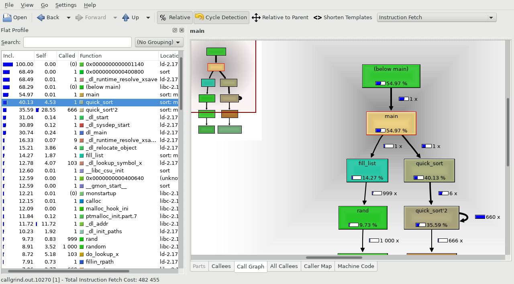

# Initial task

Take the code in `sort.c` and try to make it run faster.

*Question* what steps would you take to make this happen?

# Approach

## Does the code run and do what it should?

Let's compile and run

```
$ gcc sort.c -o sort
$ ./sort 5
```

Any memory issues (run with `valgrind`) or other warnings (compile with `-Wall`).

```
$ gcc sort.c -o sort -g -Wall
$ valgrind ./sort 5
```

## Basic algorithm improvements

The original code uses bubble sort. Merge sort *should* be faster. There is an implementation in `merge-sort.c`

## Is the compiler doing all it can?

`gcc` is an optimising compiler. Use the flags `-O1`, `-O2` or `-O3` for different levels of optimisation (`-O0` mean no optimisation, better for debugging). You should see which ones give the best results.

```
$ gcc merge-sort.c -o sort -O3
```

## Profiling

You can see which bits of code are taking the longest to run or being called the most using a profiler. I recommend using `callgrind` and `kcachegrind`.

First compile with the extra flags `-g -pg`:
```
$ gcc merge-sort.c -o sort -O3 -g -pg
```
Then run with the following command
```
$ valgrind --tool=callgrind ./sort 1000
```
This generates a file called something like `callgrind.out.10270` which can be opened with `kcachegrind`.
```
$ kcachegrind callgrind.out.10270
```

This should look something like this:
{width=100%}

This gives you an overview of which functions have been called, how many times and how much of the overall runtime was using in that function. It also generates a call-tree which shows this information in a more hierarchic view.

## Use more cores

You can also use more of the cores on your machine but I won't go into this here. You can look up `openmp` and `mpi` to find out more.

